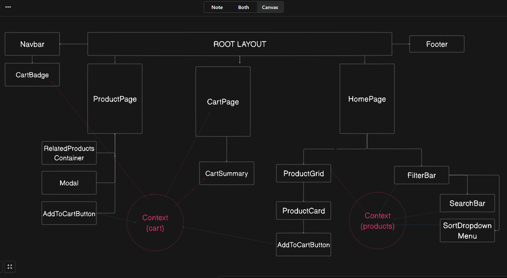

# How to run
First, run **npm install** in the project directory to install all necessary dependencies. After installation is complete, start the local development server with **npm run dev**. The project should then open on localhost:3000.

## Project Overview
This is an e-commerce project that focus exclusively on the front-end side of things. It uses the https://fakestoreapi.com/ to fetch an array of 20 products. The user can search for products, add the products to the shopping cart, remove them, filter them by category and sort them by price or better rating.

The project contains 3 pages:

Homepage: where the user can see the list of products and apply filters.
Product page: where the user can see the product's information, including description, full size image and related products.
Cart page: where the user can see the summary of the order and change the number of items in the purchase. It also includes the price sum of the total number of items.

## Technologies involved

The project was developed in TypeScript, React, Next.js, Tailwind CSS and Cypress for testing.

Observations: even though I very much prefer to keep the styling separated from the main code, Tailwind is heavily recommended by the Next.js framework, and its advantages can't be denied. 

## E2E Tests

I included 8 E2E tests (Cypress) to assure the filtering and sorting features work properly. As the project grows bigger and more features are added, these tests should keep the integrity of the code and avoid regressions.

To run the tests, execute **npx cypress open** (after having installed all the dependencies via npm install), then choose **E2E Testing**, and choose your prefered browser. After that, you should see 2 specs: **TEST_CATEGORY_FILTERS** and **TEST_SORT_FILTERS**. Clicking in any of them will run the tests and displays the resulsts automatically.

## Possible next steps

If this was a real life project, the top priority would be: 

• improve the initial loading time of the page. This can easily be achieved via Suspense Boundaries, Code Splitting, Lazy Loading, Streaming, etc.

• write a lot more tests to preserve the other existing functionalities that were not covered in the current tests.

In a less urgent note, possible next steps would be:

• UI improvements and refinements.
• integrate the Auth.js library to implement login/authentication feature.
• integrate the Stripe library to implement payment.
• wishlist feature (after we have implemented the login).
• images of the items inside the CartPage should be Links to that specific product's page.
• product comparison page (displays 2 or 3 products side by side for comparison).
• breadcrumbs in the ProductPage. Example: Men's Clothing -> Mens Casual Premium Slim Fit T-Shirts.

## Project Overview

